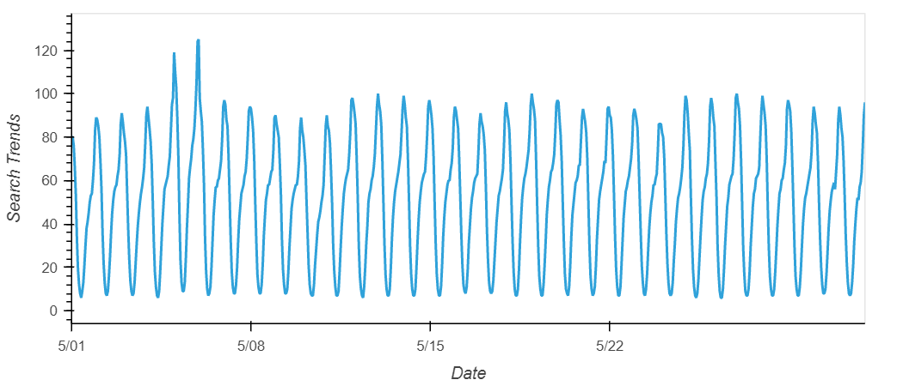
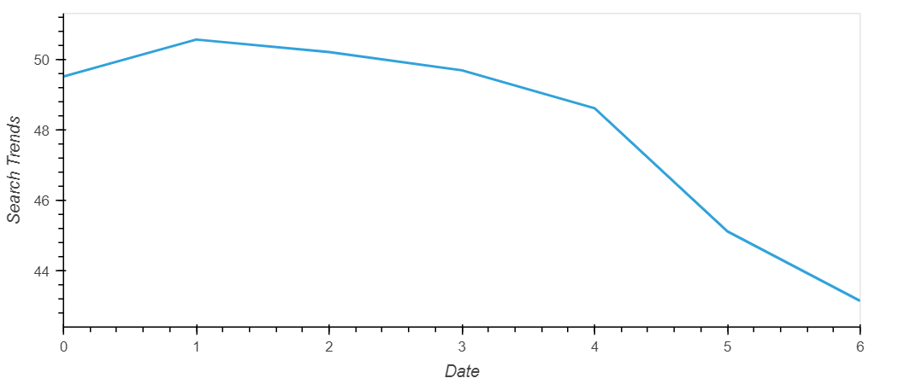
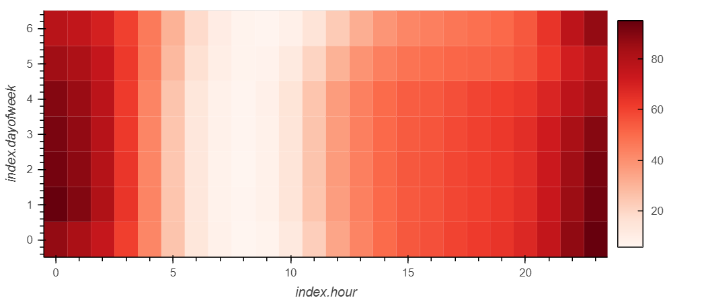
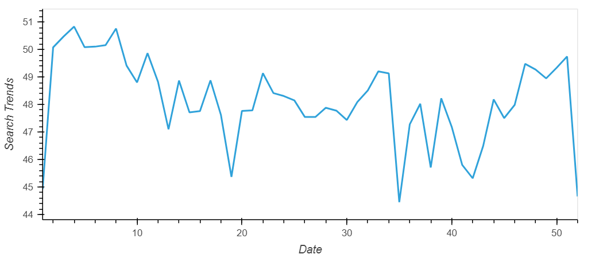
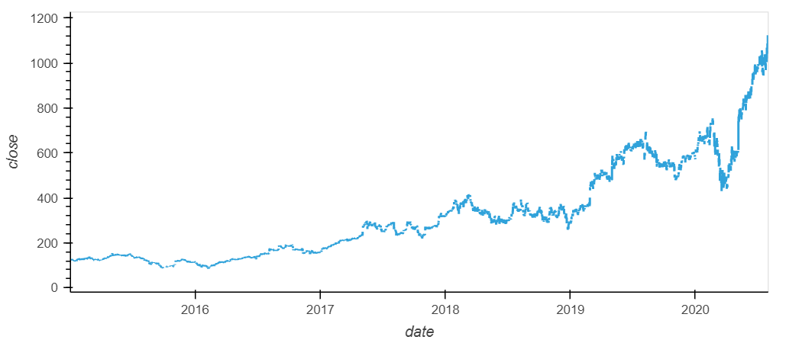
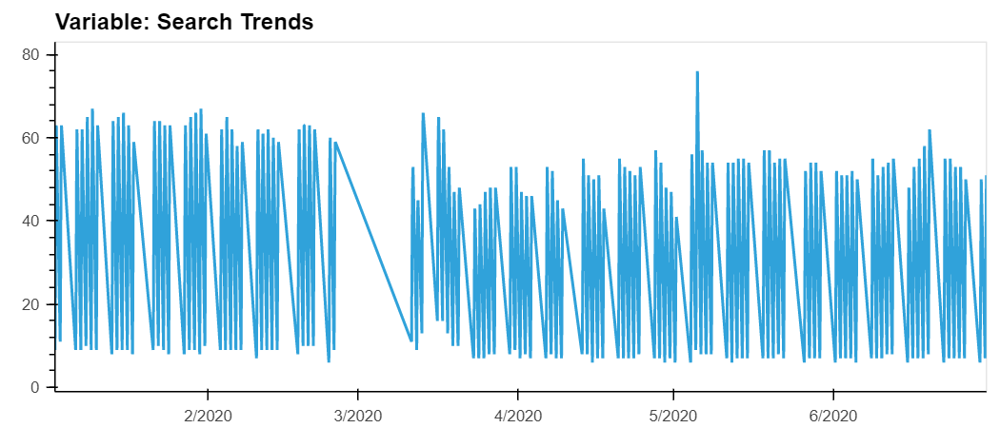
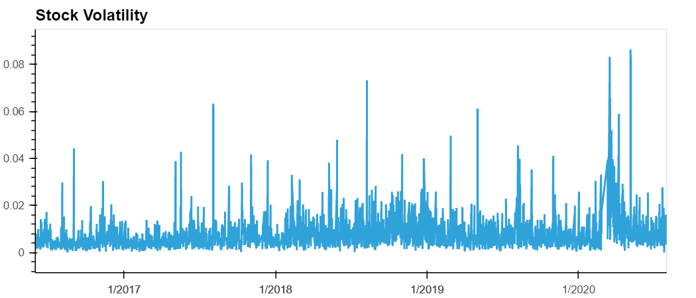
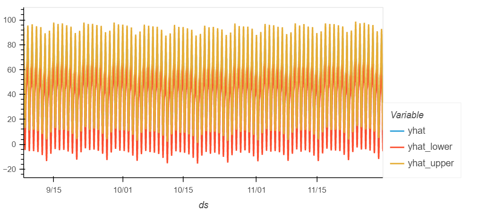
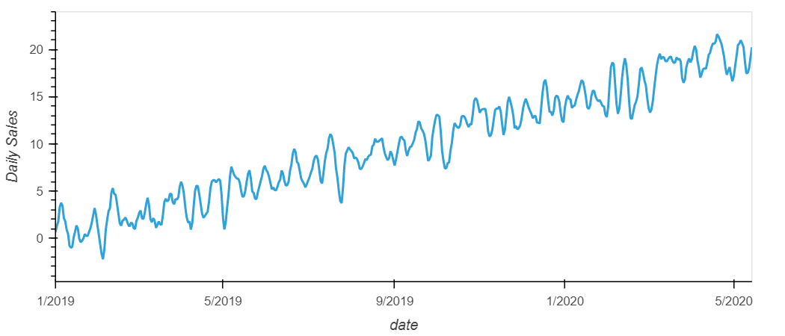

# forecasting_net_prophet

Analysing Mercado Libre's financial and user data in clever ways to help the company grow.

**hvPlot to visualize the data for May 2020**

**Question:** Did the Google search traffic increase during the month that MercadoLibre released its financial results?

**Answer:** Yes, the Google search traffic increased from an overall monthly median value of 51 to 54 in May 2020 - the month that MercadoLibre released its financial results.

**Average traffic by the day of week**

**hvPlot to visualize the hour of the day and day of week search traffic as a heatmap**

**Question:** Does any day-of-week effect that you observe concentrate in just a few hours of that day?

**Answer:** Based on the heatmap, it appears that search traffic is highest during 11pm to midnight on weekends and from 11pm to 1am on all weekdays except Friday.

**Average traffic by the week of the year**

**Question:** Does the search traffic tend to increase during the winter holiday period (weeks 40 through 52)?

**Answer:** The traffic tends to increase during the winter holiday period. However, it initially dips in weeks 40 and 41 before increasing.

**hvPlot to visualize the closing price of the df_mercado_stock DataFrame**

**hvPlot to visualize the close and search trends data for first half of 2020**

**Question:** Do both time series indicate a common trend that’s consistent with this narrative?

**Answer:** Subsequent to COVID-19 being declared a pandemic by WHO in March 2020, the stock price and search declined dramatically. Both, the stock price and search, gradually picked up around April 2020 and then consistently went up.

**hvPlot to visualize the stock volatility**

**Question:** Does a predictable relationship exist between the lagged search traffic and the stock volatility or between the lagged search traffic and the stock price returns?

**Answer:** There does not appear to be a predictable relationship between the lagged search traffic and the stock volatility or between the lagged search traffic and the stock price returns.

**use **hvPlot to visualize the yhat, yhat_lower, and yhat_upper columns over the last 2000 hours**

**hvPlot to visualize the daily sales figures**
